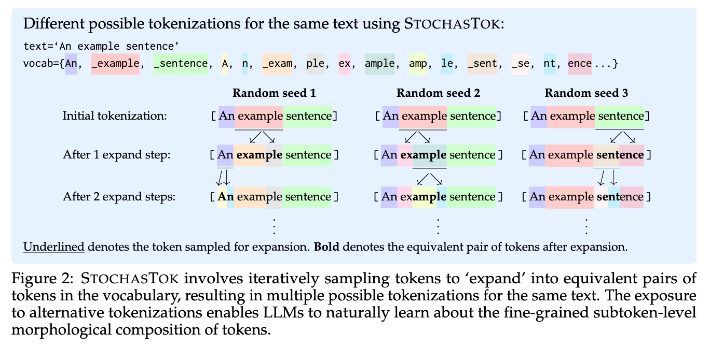
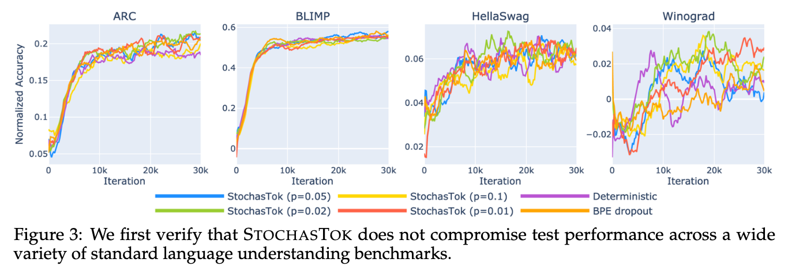
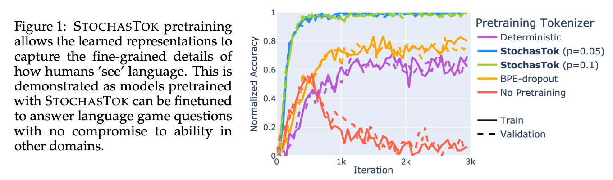
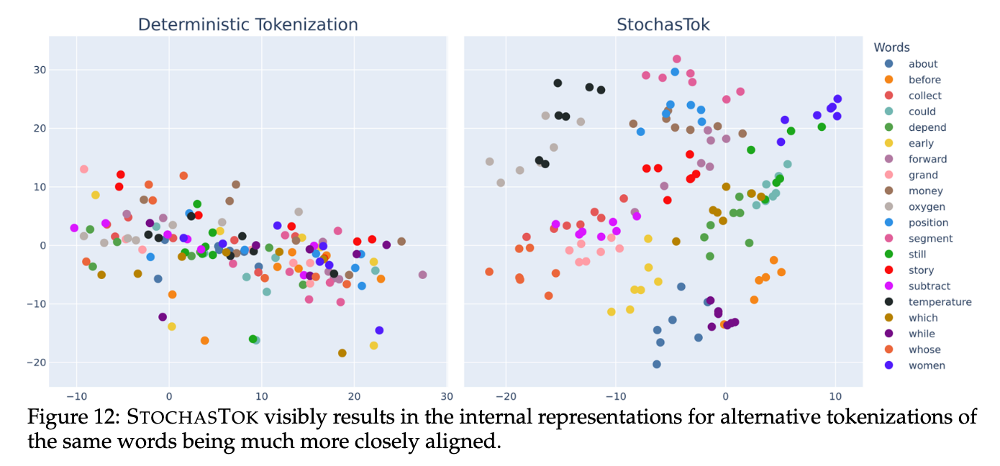

<h1 align="center">StochasTok: Improving Fine-Grained Subword Understanding in LLMs</h1>

<p align="center">
    <em>Paper preview.<br>
      ArXiv version, code, and new results coming soon!</em>
</p>

# tl;dr

<div align="center">

**Instead of standard tokenization... use stochastic tokenization!**



&nbsp;

**There is no compromise to original performance.**



&nbsp;

**It dramatically improves downstream performance on language game tasks**



&nbsp;

**StochasTok-trained models grok multi-digit addition**


&nbsp;

**And it visibly alters LLMs' internal representations**

</div>

&nbsp;

***For more results please see our paper!***

- StochasTok can be applied without pretraining from scratch,
- Is robust to hyperparameter choice,
- Has OOD generalization properties,
- Scales to larger models,
- and more...

# Citation

```
@misc{sims2025stochastok,
      title={StochasTok: Improving Fine-Grained Subword Understanding in LLMs}, 
      author={Anya Sims and Thom Foster and Klara Kaleb and Jakob N. Foerster and Yee Whye Teh and Cong Lu},
      year={2025},
}
```
